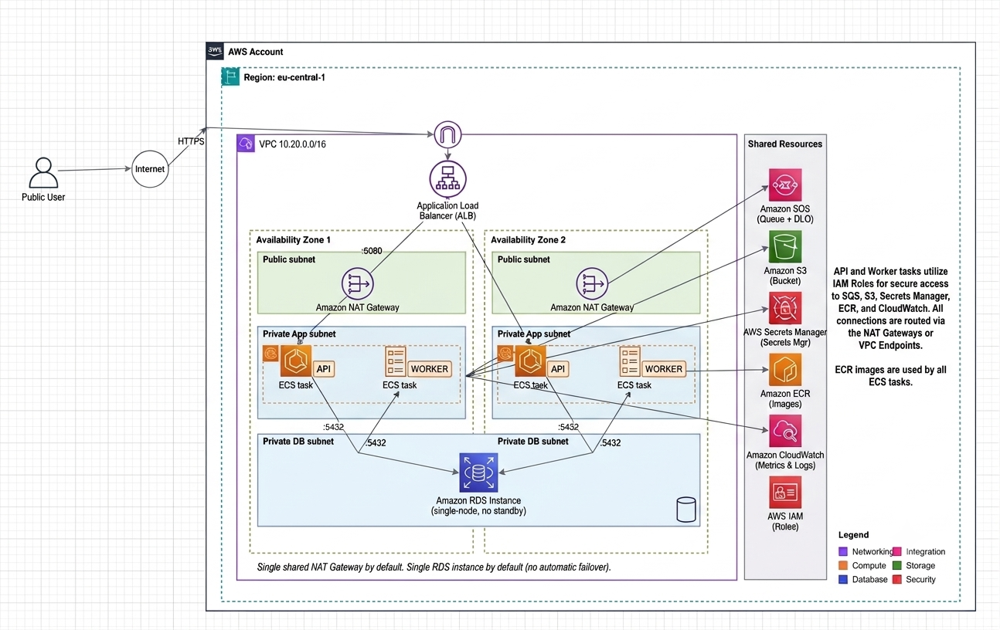

# DevOps Take-Home: AWS Infrastructure on ECS Fargate

Terraform code (in [`infra/`](infra/)) that provisions a containerized
application environment on AWS: a VPC with public/private/database subnets,
a public API service and a private background worker service running as
separate ECS Fargate services behind (and outside of) an ALB respectively,
an RDS Postgres database, an SQS queue, an S3 bucket, two ECR repositories,
and the IAM roles and Secrets Manager entries that tie it all together —
plus the actual application code those two services run, in
[`app/`](app/).

## Repo structure

```
.
├── infra/     # All Terraform — see infra/ for the module itself
├── app/       # Application source for the api and worker containers,
│              # see app/README.md for how to build/run each locally
└── docs/
    └── genai-usage.md   # GenAI usage log: prompts + rationale
```

## Main architecture choices

- **Three-tier VPC** (public / private-app / private-db) so the ALB is the
  only thing with a public-facing surface; RDS and both ECS services live
  in private subnets, with a NAT Gateway for their outbound-only traffic.
- **Public API and private worker as two independent ECS Fargate
  services**, not one — separate task definitions, security groups, IAM
  task roles, and ECR repos, so each is scoped to exactly what it does
  (detailed in "API vs. worker services" below).
- **Postgres (RDS) as the system of record**, with **SQS decoupling intake
  from processing** — the API's job is just "accept the request, persist
  it, hand off a message"; the worker's job is entirely separate and can
  scale, fail, or restart independently of the API.
- **S3** for object storage, **ECR** for both service images, **Secrets
  Manager** for DB credentials, and **least-privilege IAM** throughout
  (per-service task roles, an execution role scoped to agent-level actions
  only) — see the sections below and "Notable design decisions" for the
  reasoning behind each.
- **Root-module Terraform**, flat files, no child modules — appropriate for
  a single-environment deliverable like this one.

## Architecture



**Traffic flow:** Internet → ALB (public subnets) → **API** ECS Fargate
tasks (private app subnets, `awsvpc` networking) → RDS (private database
subnets). The **worker** service runs in the same private app subnets but
sits behind its own security group with **no ingress rules at all** — it is
not attached to the ALB target group and is not reachable from the ALB, the
internet, or the API service; it only pulls jobs from SQS. Both services
reach the internet (e.g. for ECR image pulls) through a NAT Gateway; nothing
in the app or database tiers has a public IP.

## Resources provisioned

| Category | Resources |
|---|---|
| Networking | VPC, 2 public + 2 private + 2 database subnets across 2 AZs, IGW, NAT Gateway, route tables, 4 security groups (ALB, ECS API, ECS worker, RDS) |
| Compute | ECS cluster, **two** Fargate task definitions and **two** ECS services (`api`, `worker`), Application Load Balancer, target group, HTTP listener (API only — the worker is not attached to the ALB) |
| Registry | Two ECR repositories, `api` and `worker` (image scanning on push, lifecycle policy retaining last 10 images each) |
| Data | RDS PostgreSQL instance (private, encrypted, in its own subnet group), SQS queue + dead-letter queue |
| Storage | S3 bucket (versioned, SSE-encrypted, public access blocked) |
| Secrets | Secrets Manager secret holding the generated RDS master credentials, injected into both ECS task definitions via the `secrets` block |
| IAM | One shared ECS task execution role (image pull, log write, secret read) plus **two distinct task roles** — `ecs_task_api` (SQS send-only, S3 read/write) and `ecs_task_worker` (SQS receive/delete on the queue and DLQ, S3 read/write/delete) — each scoped to only what that service needs |

### API vs. worker services

| | API service | Worker service |
|---|---|---|
| Reachable from ALB? | Yes — target group + listener | No — not registered with any target group |
| Public/private | Public (via ALB, tasks themselves stay in private subnets) | Private — no ingress rule exists on its security group |
| Security group | `ecs_api` — ingress from ALB SG on `container_port` only | `ecs_worker` — no ingress rules at all |
| IAM task role | `ecs_task_api` — `sqs:SendMessage`/`GetQueueUrl`/`GetQueueAttributes`, S3 get/put/list | `ecs_task_worker` — `sqs:ReceiveMessage`/`DeleteMessage`/`GetQueueAttributes`/`GetQueueUrl` on queue + DLQ, S3 get/put/delete/list |
| Task definition | `aws_ecs_task_definition.api` (`var.api_image`, container port exposed) | `aws_ecs_task_definition.worker` (`var.worker_image`, no port mappings) |
| Scaling | `var.api_desired_count` (default 2) | `var.worker_desired_count` (default 1) |

## How containers receive secrets securely

RDS's master password is generated by Terraform (`random_password` in
`infra/secrets.tf`) — it's never typed in by hand and never appears in
`terraform.tfvars`. It's stored as a single JSON secret
(`aws_secretsmanager_secret.db_credentials`) in Secrets Manager, alongside
the username.

Neither task definition puts the password in its plaintext `environment`
list. Both the `api` and `worker` containers instead reference it through
the ECS `secrets` block, with `valueFrom` pointing at the secret ARN plus a
JSON key selector (`:username::` / `:password::`). At task launch, the ECS
agent — using the **execution role**, not the app's own task role —
resolves those and injects them as the `DB_USERNAME`/`DB_PASSWORD`
environment variables the container sees. The value itself is never
written into the task definition (visible via `DescribeTaskDefinition` to
anyone with read access to the cluster); it only ever exists in Secrets
Manager and inside the running container's environment.

Only the shared `ecs_task_execution` role can read that secret
(`secretsmanager:GetSecretValue`, scoped to that one secret's ARN — see
`infra/iam.tf`). Neither the `ecs_task_api` nor `ecs_task_worker` role has
Secrets Manager permissions at all; they don't need them, since secret
resolution happens at the agent level before the app container even starts.

## How the worker communicates with the API, database, and queue

The worker and the API **never talk to each other directly** — there is no
network path between them at all. The worker's security group
(`ecs_worker`) has zero ingress rules, and it isn't attached to any load
balancer or target group, so nothing (not the ALB, not the internet, not
even the API's security group) can open a connection to it.

All coordination between the two happens through two indirect channels:

- **SQS**, one-directional by IAM design: the API's task role can only
  `sqs:SendMessage`; the worker's task role can only
  `sqs:ReceiveMessage`/`DeleteMessage`/`GetQueueAttributes`, on that same
  queue and its DLQ. The queue is the only hand-off point between them.
- **Postgres**, as shared state rather than a direct call: the API writes
  a `jobs` row and returns immediately; later, using only the job id
  carried in the SQS message body, the worker looks up and updates that
  same row (stamping `processed_at`) once it's done. Neither service calls
  the other's API — they just both read/write the same table.

This is deliberate: the API keeps accepting requests even if every worker
task is down (jobs simply queue up in SQS), and the worker never needs an
open inbound port, so it was never reachable from the internet even before
considering IAM.


## Deploying new container versions, and rolling back

**Deploy:** build the new image, push it to the relevant ECR repo under a
new tag, set `api_image` or `worker_image` in `terraform.tfvars` to that
tag, then `terraform apply` from `infra/`. That creates a new ECS task
definition revision and triggers a normal rolling deployment — ECS starts
tasks on the new revision and only shifts ALB traffic to them once they
pass the target group's health check, draining the old tasks afterward.

**Roll back:** the same mechanism in reverse — set the image variable back
to the previous known-good tag and re-apply. ECS also keeps every prior
task definition revision around, so if you need to roll back *before*
you've fixed whatever's wrong in Terraform, you can point the service at a
specific old revision directly:

```bash
aws ecs update-service --cluster <cluster> --service <api-or-worker-service> \
  --task-definition <family>:<previous-revision> --force-new-deployment
```

That's a faster, imperative fix — follow it up with a `terraform apply`
that sets the image variable to match, so Terraform state and the running
service don't drift apart.

> **Real example encountered during testing:** the ALB target group's
> `health_check_path` defaulted to `/`, but `app/api` only serves `/health`
> and `/jobs` — there is no `/`. Every deployment of the real API image
> failed its target-group health check, so ECS's deployment circuit
> breaker judged the deployment unhealthy and automatically rolled the
> service back to the placeholder `nginx` image — a real, AWS-triggered
> instance of exactly the rollback path described above. It was fixed by
> changing `health_check_path` to `/health` in `infra/variables.tf` and
> re-running `terraform apply` — not by editing the target group by hand in
> the console — so the fix stayed reproducible instead of silently
> diverging from what Terraform thought was deployed.

## Troubleshooting: API works, but the worker isn't processing jobs

Three checks, roughly in the order that separates the most likely causes
fastest:

1. **Is the worker service actually running?**
   `aws ecs describe-services --cluster <cluster> --services <worker-service>`
   for desired vs. running count, then the `/ecs/<project>-<env>-worker`
   CloudWatch log group. If running count is 0 or tasks keep restarting,
   this isn't a queue problem at all — the worker is failing to start (bad
   image, can't reach RDS, missing `sqs:ReceiveMessage` permission, etc.),
   and no amount of looking at SQS will explain it.
2. **Where are the messages sitting?**
   `aws sqs get-queue-attributes --queue-url <queue-url> --attribute-names
   ApproximateNumberOfMessages ApproximateNumberOfMessagesNotVisible`.
   Messages stuck in *NotVisible* (not *Visible*) means the worker **is**
   receiving them but failing before it deletes them — check the DLQ
   (`app-dlq`) next; a growing DLQ means jobs are failing worker-side and
   being redriven repeatedly, not that they were never received.
3. **Does the DB side of the handoff actually line up?**
   Confirm the API is really writing job rows (check its logs for insert
   errors, or query the `jobs` table directly), and that the worker is
   resolving the *same* `DB_HOST`/`DB_NAME`/credentials as the API. A
   worker pointed at stale env vars (e.g. a task definition change that
   didn't actually roll out) will connect to Postgres successfully but
   silently hit `process_job`'s `no job row found for id=...` check — which
   shows up only in the worker's CloudWatch logs, not as anything visible
   from the queue side.

## GPU Interface
   Scaling a GPU service to zero comes down to one idea: don't run it as a normal "always-on" ECS service — instead set its minimum task count to 0, and let ECS Application Auto Scaling watch a queue (SQS) for how many jobs are waiting. When a job shows up, auto scaling spins up a GPU task to handle it; when the queue's been empty for a bit, it scales back down to zero so you stop paying for idle GPU time. The only real cost of this is a "cold start" delay on the very first request after being idle, since a fresh GPU container has to boot up before it can respond.  

## Terraform fmt and Validation


   ...
