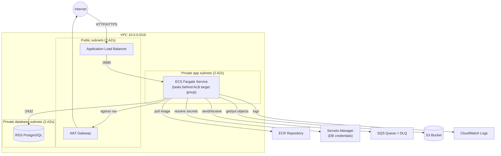

# DevOps Take-Home: AWS Infrastructure on ECS Fargate

Terraform code that provisions a containerized application environment on AWS:
a VPC with public/private/database subnets, an ALB-fronted ECS Fargate
service, an RDS Postgres database, an SQS queue, an S3 bucket, an ECR
repository, and the IAM roles and Secrets Manager entries that tie it all
together.

## Architecture



**Traffic flow:** Internet → ALB (public subnets) → ECS Fargate tasks
(private app subnets, `awsvpc` networking) → RDS (private database subnets).
Fargate tasks reach the internet (e.g. for ECR image pulls or third-party
APIs) through a NAT Gateway; nothing in the app or database tiers has a
public IP.

## Resources provisioned

| Category | Resources |
|---|---|
| Networking | VPC, 2 public + 2 private + 2 database subnets across 2 AZs, IGW, NAT Gateway, route tables, 3 security groups (ALB, ECS, RDS) |
| Compute | ECS cluster, Fargate task definition, ECS service, Application Load Balancer, target group, HTTP listener |
| Registry | ECR repository (image scanning on push, lifecycle policy retaining last 10 images) |
| Data | RDS PostgreSQL instance (private, encrypted, in its own subnet group), SQS queue + dead-letter queue |
| Storage | S3 bucket (versioned, SSE-encrypted, public access blocked) |
| Secrets | Secrets Manager secret holding the generated RDS master credentials, injected into the ECS task via the `secrets` block |
| IAM | ECS task execution role (image pull, log write, secret read) and ECS task role (SQS + S3 access for the app), both least-privilege |

## Prerequisites

- [Terraform](https://developer.hashicorp.com/terraform/install) >= 1.5
- An AWS account and credentials configured (e.g. via `aws configure`,
  environment variables, or an SSO profile) with permissions to create the
  resources above
- (Optional) Docker, if you intend to build and push a real application
  image to the ECR repository this creates

This code was written and validated with Terraform v1.13.0. No AWS
credentials are required to run `terraform fmt` or `terraform validate`;
credentials are only needed for `terraform plan`/`apply`.

## Usage

```bash
# Review/adjust variables (region, sizing, CIDRs, etc.)
cp terraform.tfvars.example terraform.tfvars

terraform init
terraform fmt -check -recursive
terraform validate
terraform plan
terraform apply
```

By default the ECS service runs a public placeholder image
(`public.ecr.aws/nginx/nginx:latest`) so the stack is deployable end-to-end
without an application build. To run your own app:

```bash
# After `terraform apply` has created the ECR repo:
aws ecr get-login-password --region <region> | \
  docker login --username AWS --password-stdin <account-id>.dkr.ecr.<region>.amazonaws.com

docker build -t <ecr_repository_url>:latest .
docker push <ecr_repository_url>:latest

# Then set app_image = "<ecr_repository_url>:latest" in terraform.tfvars
# and re-apply.
```

Grab the load balancer URL from the outputs:

```bash
terraform output alb_dns_name
```

## Cleanup

```bash
terraform destroy
```

RDS is created with `skip_final_snapshot = true` by default (see
`db_skip_final_snapshot` in `variables.tf`) so `destroy` doesn't hang waiting
on a snapshot; flip that to `false` for anything beyond a throwaway
environment.

## Notable design decisions / trade-offs

- **Single shared NAT Gateway by default** (`single_nat_gateway = true`) to
  keep cost down for a take-home exercise; set it to `false` for one NAT
  Gateway per AZ in a real HA deployment.
- **HTTP-only ALB listener.** No ACM certificate/domain was provided, so
  there's no HTTPS listener. Adding one is a matter of an
  `aws_acm_certificate` (or importing an existing cert) plus a 443
  `aws_lb_listener` and redirecting 80 → 443.
- **RDS credentials** are generated with `random_password`, stored in
  Secrets Manager, and injected into the ECS task via the task definition's
  `secrets` block (`valueFrom` referencing the secret ARN) rather than as
  plaintext environment variables.
- **Root module, flat files** (`vpc.tf`, `ecs.tf`, `rds.tf`, etc.) rather
  than child modules — appropriate for a single-environment take-home; a
  multi-environment setup would extract these into reusable modules under
  `modules/`.
- **Fargate tasks have no public IP** and reach ECR/Secrets
  Manager/CloudWatch through the NAT Gateway; VPC endpoints would remove
  that NAT dependency for AWS API traffic in a cost- or latency-sensitive
  production setup.

## Repo layout

```
.
├── versions.tf                # Terraform + provider version constraints
├── variables.tf                # Input variables
├── vpc.tf                      # VPC, subnets, routing, security groups
├── alb.tf                      # Application Load Balancer
├── ecr.tf                      # ECR repository
├── ecs.tf                      # ECS cluster, task definition, service
├── rds.tf                      # RDS PostgreSQL instance
├── sqs.tf                      # SQS queue + DLQ
├── s3.tf                       # S3 bucket
├── secrets.tf                  # Secrets Manager secret + generated password
├── iam.tf                      # IAM roles/policies for ECS tasks
├── outputs.tf                  # Output values
├── terraform.tfvars.example    # Example variable values
├── docs/
│   └── genai-usage.md          # GenAI usage log: prompts + rationale
└── README.md
```
